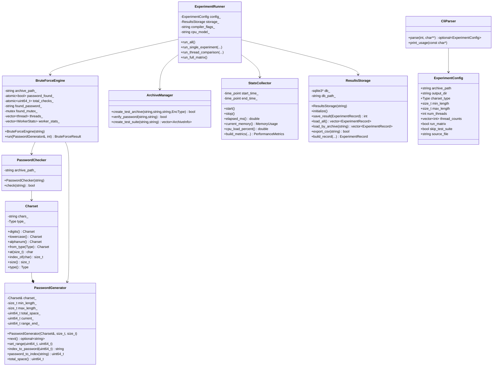

# Диаграмма классов

```mermaid
classDiagram
    class Charset {
        -string chars_
        -Type type_
        +digits() Charset
        +lowercase() Charset
        +alphanum() Charset
        +from_type(Type) Charset
        +at(size_t) char
        +index_of(char) size_t
        +size() size_t
        +type() Type
    }

    class PasswordGenerator {
        -Charset& charset_
        -size_t min_length_
        -size_t max_length_
        -uint64_t total_space_
        -uint64_t current_
        -uint64_t range_end_
        +PasswordGenerator(Charset&, size_t, size_t)
        +next() optional~string~
        +set_range(uint64_t, uint64_t)
        +index_to_password(uint64_t) string
        +password_to_index(string) uint64_t
        +total_space() uint64_t
    }

    class PasswordChecker {
        -string archive_path_
        +PasswordChecker(string)
        +check(string) bool
    }

    class BruteForceEngine {
        -string archive_path_
        -atomic~bool~ password_found_
        -atomic~uint64_t~ total_checks_
        -string found_password_
        -mutex found_mutex_
        -vector~thread~ threads_
        -vector~WorkerStats~ worker_stats_
        +BruteForceEngine(string)
        +run(PasswordGenerator&, int) BruteForceResult
    }

    class ArchiveManager {
        +create_test_archive(string,string,string,EncType) bool
        +verify_password(string,string) bool
        +create_test_suite(string,string) vector~ArchiveInfo~
    }

    class StatsCollector {
        -time_point start_time_
        -time_point end_time_
        +start()
        +stop()
        +elapsed_ms() double
        +current_memory() MemoryUsage
        +cpu_load_percent() double
        +build_metrics(...) PerformanceMetrics
    }

    class ResultsStorage {
        -sqlite3* db_
        -string db_path_
        +ResultsStorage(string)
        +initialize()
        +save_result(ExperimentRecord) int
        +load_all() vector~ExperimentRecord~
        +load_by_archive(string) vector~ExperimentRecord~
        +export_csv(string) bool
        +build_record(...) ExperimentRecord
    }

    class ExperimentRunner {
        -ExperimentConfig config_
        -ResultsStorage storage_
        -string compiler_flags_
        -string cpu_model_
        +run_all()
        +run_single_experiment(...)
        +run_thread_comparison(...)
        +run_full_matrix()
    }

    class CliParser {
        +parse(int, char**) optional~ExperimentConfig~
        +print_usage(const char*)
    }

    class ExperimentConfig {
        +string archive_path
        +string output_dir
        +Type charset_type
        +size_t min_length
        +size_t max_length
        +int num_threads
        +vector~int~ thread_counts
        +bool run_matrix
        +bool skip_test_suite
        +string source_file
    }

    Charset --* PasswordGenerator
    PasswordChecker --> Charset
    BruteForceEngine --> PasswordGenerator
    BruteForceEngine --> PasswordChecker
    ExperimentRunner --> BruteForceEngine
    ExperimentRunner --> StatsCollector
    ExperimentRunner --> ResultsStorage
    ExperimentRunner --> ArchiveManager
    CliParser --> ExperimentConfig
```
