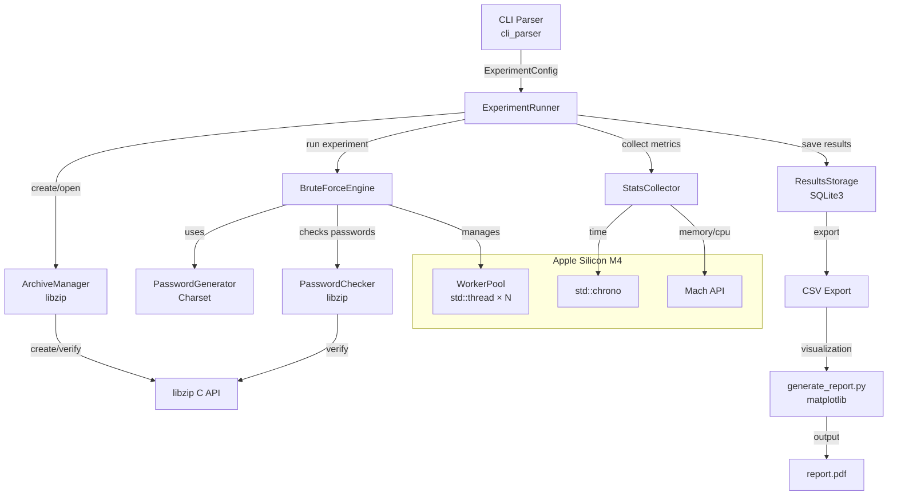

# Диаграмма компонентов

```mermaid
graph TD
    CLI[CLI Parser\ncli_parser] -->|ExperimentConfig| Runner[ExperimentRunner]
    Runner -->|create/open| AM[ArchiveManager\nlibzip]
    Runner -->|run experiment| BFE[BruteForceEngine]
    Runner -->|collect metrics| SC[StatsCollector]
    Runner -->|save results| RS[ResultsStorage\nSQLite3]

    BFE -->|uses| PG[PasswordGenerator\nCharset]
    BFE -->|checks passwords| PC[PasswordChecker\nlibzip]
    BFE -->|manages| WP[WorkerPool\nstd::thread × N]

    SC -->|time| CHRONO[std::chrono]
    SC -->|memory/cpu| MACH[Mach API]

    RS -->|export| CSV[CSV Export]
    CSV -->|visualization| PY[generate_report.py\nmatplotlib]
    PY -->|output| PDF[report.pdf]

    AM -->|create/verify| LIBZIP[libzip C API]
    PC -->|verify| LIBZIP

    subgraph "Apple Silicon M4"
        WP
        MACH
        CHRONO
    end
```
