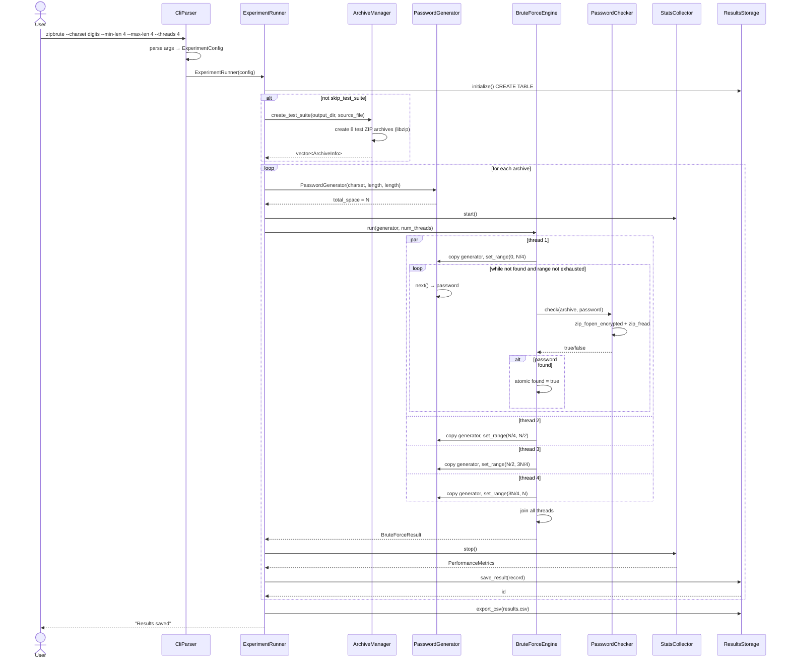
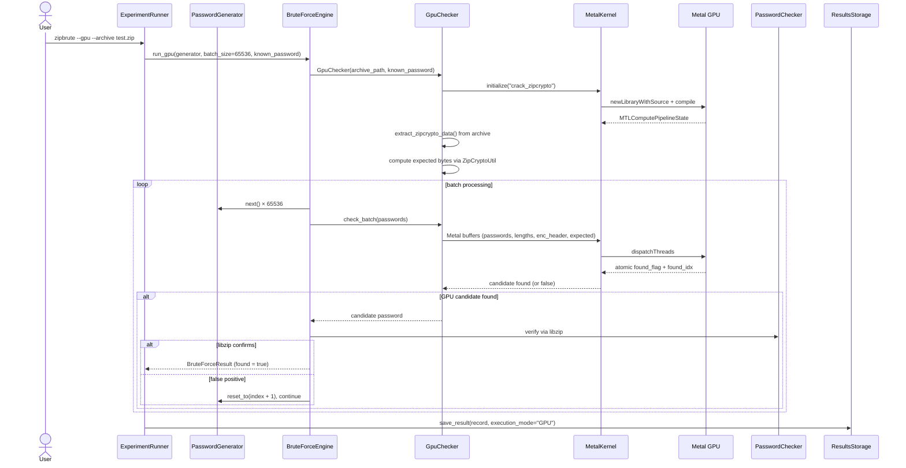
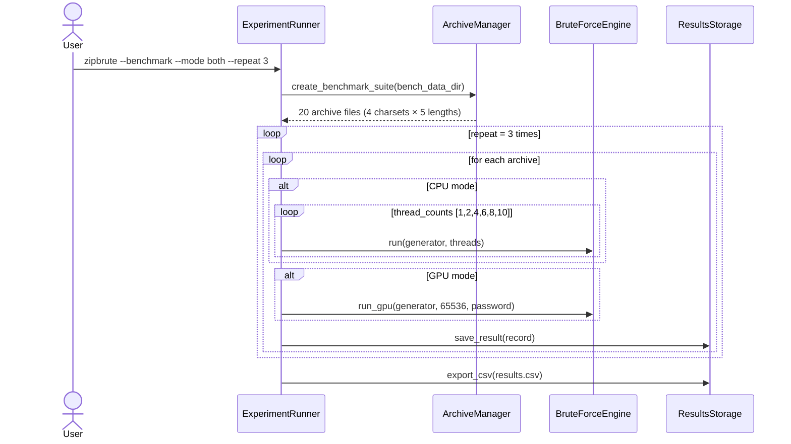

# Диаграмма последовательности запуска эксперимента

## Режим CPU (test suite)

## Режим GPU

## Режим benchmark

## Этапы обработки

1. **Парсинг аргументов** — CLI разбирает параметры, валидирует (включая GPU и benchmark флаги)
2. **Инициализация БД** — создание таблицы experiments в SQLite (все поля включая execution_mode)
3. **Создание тестовых архивов** — ArchiveManager фабрика (libzip, без shell-команд)
4. **Запуск эксперимента** — для каждого архива:
   - Инициализация генератора паролей (Charset хранится по значению)
   - Замер времени (StatsCollector)
   - CPU: многопоточный перебор с atomic-флагом остановки
   - GPU: батчевый перебор через Metal kernel с верификацией через libzip
   - Фиксация результата и метрик
5. **Сохранение** — запись в SQLite + экспорт CSV (с экранированием полей)
